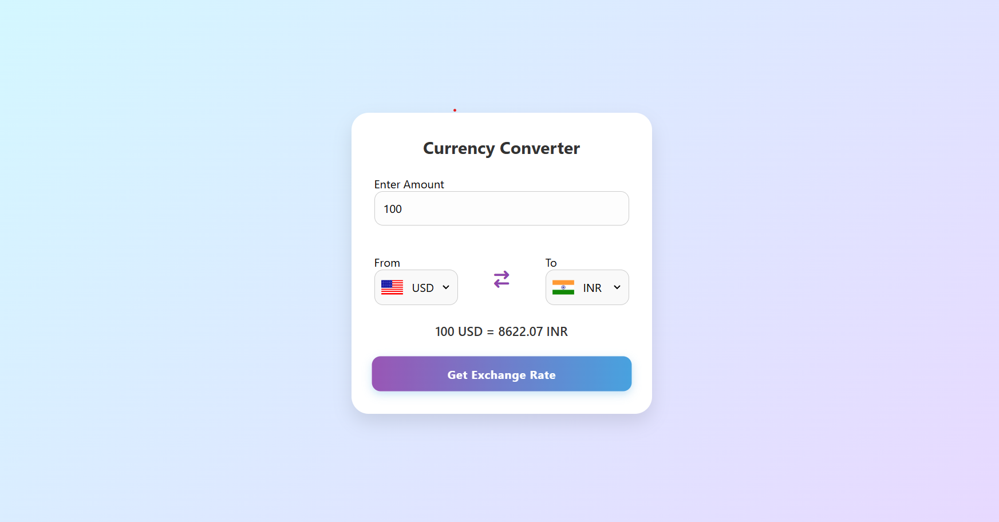

# 💱 Currency Converter 🌍

A sleek and user-friendly **Currency Converter Web App** built using **HTML, CSS, and JavaScript**, which allows users to convert between different currencies in real-time using [ExchangeRate-API].

---

## ✨ Features

- 🌐 **Real-time currency conversion** using live exchange rates
- 🌍 **Country flags** auto-updated with each currency selection
- 📅 **Displays exchange rate with last updated date/time**
- 🎨 Beautiful, responsive design with soft pastel theme
- 📱 **Fully responsive** and mobile-optimized layout

---

## 🔧 Tech Stack

- **HTML5** – Structure
- **CSS** – Styling and responsiveness
- **JavaScript** – Logic, Fetch API, DOM manipulation
- **[ExchangeRate-API](https://v6.exchangerate-api.com/v6/546b46af005bd409624835ce/latest)** – Real-time currency data

## 🚀 How to Use

👉 [Click here to use the Currency Converter App](https://himanshu-shekhar2327.github.io/currency-converter/)

> Here's a preview of the Currency Converter in action:

---

Project Structure
bash
Copy
Edit
currency-converter/
├── index.html
├── style.css
├── app.js
├── codes.js
├── README.md
└── preview.png  <-- (screenshot image)
